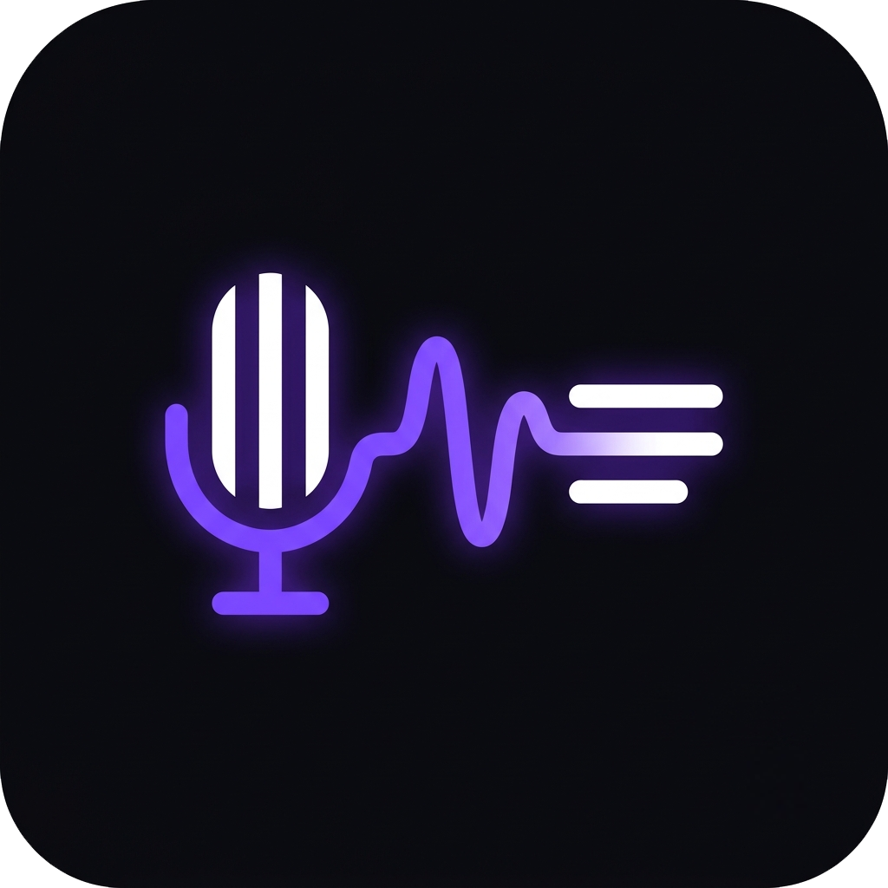
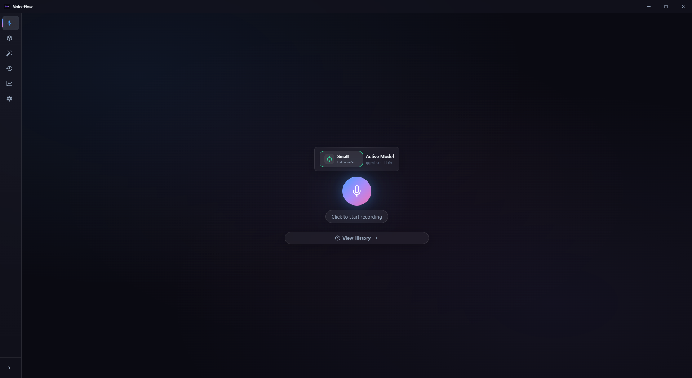

<div align="center">
  
  <h1>VoiceFlow v1.0.0</h1>
  <p><strong>Aplikasi Voice-to-Text lokal untuk Windows.</strong></p>
</div>

VoiceFlow adalah aplikasi desktop yang mengubah suara kamu menjadi teks secara real-time menggunakan AI (OpenAI Whisper) yang berjalan **sepenuhnya di komputer kamu**. Cocok untuk menulis dokumen, coding, content creation, dan kebutuhan mengetik lainnya tanpa harus menyentuh keyboard.

---

## Daftar Isi

- [Apa itu VoiceFlow?](#apa-itu-voiceflow)
- [Cara Kerja VoiceFlow](#cara-kerja-voiceflow)
- [Fitur Utama](#fitur-utama)
- [Install](#install)
- [Panduan Penggunaan](#panduan-penggunaan)
- [Model AI](#model-ai)
- [Hotkey](#hotkey)
- [Voice Commands](#voice-commands)
- [Pengaturan](#pengaturan)
- [Troubleshooting](#troubleshooting)
- [Privasi & Keamanan](#privasi--keamanan)
- [Build dari Source](#build-dari-source)
- [Credits](#credits)
- [Lisensi](#lisensi)

---

## Apa itu VoiceFlow?

VoiceFlow adalah aplikasi **voice-to-text** yang berjalan 100% lokal di komputer kamu. Artinya:

- 🎤 **Kamu bicara** → VoiceFlow merekam suara kamu
- 🧠 **AI memproses** → Whisper AI mengubah suara menjadi teks
- 📋 **Hasilnya muncul** → Teks otomatis ditempel ke aplikasi yang sedang kamu pakai

**Tidak perlu internet. Tidak perlu cloud. Tidak perlu API key.**

Semua proses terjadi di komputer kamu. Suara kamu tidak pernah keluar dari PC.

---

## Cara Kerja VoiceFlow

### Alur Proses

```
┌─────────────────────────────────────────────────────────────────────────┐
│                         CARA KERJA VOICEFLOW                           │
└─────────────────────────────────────────────────────────────────────────┘

  1. RECORD          2. TRANSCRIBE        3. CLEAN           4. PASTE
  ─────────          ────────────         ─────────          ────────
  ┌───────┐          ┌───────────┐        ┌──────────┐       ┌────────┐
  │  🎤   │  ──────▶ │  🧠 AI    │  ────▶ │  📝 Text │  ───▶ │  📋    │
  │  Mic  │          │  Whisper  │        │  Cleaner │       │  Done! │
  └───────┘          └───────────┘        └──────────┘       └────────┘
     │                    │                    │                  │
     ▼                    ▼                    ▼                  ▼
  Record suara       Konversi suara      Bersihkan teks      Tempel ke
  dari microphone    ke teks mentah      + voice commands    aplikasi aktif
```

### Penjelasan Tiap Tahap

#### 1. 🎤 Record (Merekam)
- Kamu tekan `Ctrl+Shift+Space` atau klik tombol Mic
- VoiceFlow mulai merekam suara dari microphone
- **Waveform visualizer** menampilkan level suara real-time
- **VAD (Voice Activity Detection)** otomatis deteksi saat kamu diam
- Kamu bisa lihat floating mini window di bagian bawah layar

#### 2. 🧠 Transcribe (Konversi ke Teks)
- Audio yang direkam dikirim ke **Whisper AI** (OpenAI)
- Whisper menggunakan model AI yang sudah di-download
- Proses ini terjadi **100% lokal** di komputer kamu
- Waktu transkripsi tergantung model yang dipakai:
  - Model kecil (base): ~3-5 detik
  - Model besar (large): ~10-30 detik

#### 3. 📝 Clean (Bersihkan Teks)
- Teks mentah dari Whisper masih kasar, perlu dibersihkan
- **Text Cleaner** menghapus noise, spasi berlebih, dll
- **Voice Commands** dieksekusi (paragraf baru, koma, titik, dll)
- **Fuzzy Matching** mengoreksi kata yang salah ketik
- **Dictionary** mengganti kata sesuai kamus pribadi kamu
- **Auto Capitalize** menambahkan huruf besar di awal kalimat
- **Snippet Expansion** mengganti shortcut jadi teks panjang

#### 4. 📋 Paste (Tempel)
- Teks bersih otomatis **ditempel ke clipboard**
- VoiceFlow **hide diri sendiri** sebentar
- Teks di-paste ke aplikasi yang sedang aktif (Word, VS Code, dll)
- VoiceFlow **show diri sendiri** lagi
- Clipboard dikembalikan ke teks semula
- **Floating UI menampilkan "Done!"** sebagai konfirmasi

### Diagram Lengkap

```
┌──────────┐     ┌─────────────┐     ┌──────────┐     ┌──────────┐
│  Mic     │────▶│  Audio      │────▶│  Whisper │────▶│  Text    │
│  Input   │     │  Processing │     │  AI      │     │  Output  │
└──────────┘     └─────────────┘     └──────────┘     └──────────┘
                       │                                      │
                       ▼                                      ▼
                ┌──────────────┐                    ┌────────────────┐
                │ Noise Gate   │                    │ Smart Cleanup  │
                │ Compressor   │                    │ Voice Commands │
                │ Normalizer   │                    │ Dictionary     │
                │ HPF + LPF    │                    │ Snippets       │
                └──────────────┘                    └────────────────┘
                                                           │
                                                           ▼
                                                    ┌──────────────┐
                                                    │  Auto-Paste  │
                                                    │  ke Aplikasi │
                                                    └──────────────┘
```

---

## Fitur Utama

### 🎙️ Voice-to-Text Core

| Fitur | Deskripsi |
|-------|-----------|
| **Global Hotkey** | `Ctrl+Shift+Space` untuk mulai/stop recording dari aplikasi apapun |
| **Push-to-Talk** | Tahan hotkey untuk merekam, lepas untuk stop (aktifkan di Settings) |
| **Auto-Paste** | Hasil transkripsi otomatis ditempel ke aplikasi yang sedang aktif |
| **Multi-Language** | Mendukung 100+ bahasa — Indonesia, Inggris, Jepang, Korea, China, dll |
| **VAD (Voice Activity Detection)** | Otomatis berhenti merekam saat kamu diam — gak perlu pencet tombol stop |
| **Real-time Audio Level** | Indikator level suara + clipping detection biar mic gak pecah |

### 🌊 Floating Mini Window

Saat merekam, VoiceFlow menampilkan **floating toolbar** transparan di bagian bawah layar:

<div align="center">
  <h1>Floating UI Preview</h1>
  
</div>

| Tombol | Fungsi |
|--------|--------|
| **Bahasa** | Ganti bahasa langsung (ID/EN/JA/KO/ZH/Auto) |
| **Mic** | Mulai / Stop recording (klik) atau status rekaman |
| **Cancel (✕)** | Batalkan rekaman (atau tekan `Esc`) |
| **Spark (🔧)** | Salin hasil / Buka Settings |
| **Note (📄)** | Tempel hasil / Buka History |

Floating window ini:
- Selalu di atas semua aplikasi
- Bisa diklik tanpa mengambil fokus dari aplikasi yang sedang kamu pakai
- Waveform visualizer real-time
- Timer recording
- Tooltip informatif di setiap tombol

---

### 🖥️ Main Window

Tampilan utama VoiceFlow dengan sidebar navigasi dan halaman recording:



| Halaman | Fungsi |
|---------|--------|
| **Record** | Halaman utama — mic button, waveform visualizer, hasil transkripsi |
| **Models** | Download & manage AI models |
| **History** | Riwayat transkripsi dengan search & export |
| **Benchmark** | Test kecepatan & akurasi model |
| **Settings** | Konfigurasi aplikasi — recording, processing, hotkey, dll |

### 📝 Text Processing

| Fitur | Contoh |
|-------|--------|
| **Smart Cleanup** | "anu saya eh mau koma ngomong sesuatu" → "saya mau ngomong sesuatu," |
| **Voice Commands** | "paragraf baru", "bold", "italic", "heading" |
| **Punctuation** | "koma" → `,`, "titik" → `.`, "tanda tanya" → `?` |
| **Auto Capitalize** | Kapital otomatis di awal kalimat |
| **Number Words** | "seratus dua puluh tiga" → `123` |
| **Fuzzy Matching** | Koreksi otomatis kata yang mirip, bisa dikustom lewat Dictionary |
| **Personal Dictionary** | Kamus pribadi — ganti "voiceflow" → "VoiceFlow", "react" → "React" |
| **Snippets** | Shortcut — ucapkan "tanda tangan" → output teks panjang |
| **LLM Post-Processing** | Grammar correction via AI lokal untuk teks yang lebih natural |

### 📚 History & Data

| Fitur | Deskripsi |
|-------|-----------|
| **Riwayat Transkripsi** | Semua hasil transkripsi tersimpan dengan timestamp |
| **Search History** | Cari teks dalam riwayat |
| **Export CSV** | Export riwayat ke file CSV |
| **Diff View** | Lihat perbedaan antara output raw Whisper vs hasil cleaning |
| **Confidence Score** | Skor kepercayaan untuk setiap transkripsi |
| **WPM (Words Per Minute)** | Kecepatan bicara kamu |

### 🖥️ System Integration

| Fitur | Deskripsi |
|-------|-----------|
| **System Tray** | Berjalan di background, akses cepat dari tray icon |
| **Auto Start** | Jalankan otomatis saat Windows startup (opsional) |
| **GPU / CPU Selection** | Pilih mode GPU (NVIDIA CUDA) atau CPU |
| **Model Management** | Download, ganti, dan hapus model AI dari dalam aplikasi |
| **Adaptive Learning** | Belajar dari koreksi yang kamu lakukan secara otomatis |

---

## Install

### Pakai Installer (Rekomendasi)

**Download langsung:**

| File | Ukuran | Link Download |
|------|--------|---------------|
| **VoiceFlow Setup.exe** | 100.6 MB | [Download Installer](https://github.com/sudutkamar/VoiceFlow/releases/download/v1.0.0/VoiceFlow.Setup.exe) |

**Langkah install:**

1. Klik link download di atas → file `VoiceFlow.Setup.exe` akan terdownload
2. Buka file `.exe` yang sudah terdownload
3. Ikuti petunjuk instalasi (Next → Next → Install)
4. Buka VoiceFlow dari shortcut desktop atau Start Menu

**Setelah install:**

1. Buka tab **Models** di aplikasi
2. Download model AI (recommended: `ggml-base-q5_1.bin` — 57 MB untuk kecepatan, atau `ggml-small.bin` untuk akurasi)
3. Jika punya GPU NVIDIA, buka Settings → GPU → Download CUDA
4. Siap digunakan! Tekan `Ctrl+Shift+Space` untuk mulai merekam

### Download Tambahan (Opsional)

Jika butuh whisper engine terpisah atau model AI manual:

| File | Ukuran | Link Download | Deskripsi |
|------|--------|---------------|-----------|
| whisper-cpu.zip | 3.3 MB | [Download](https://github.com/sudutkamar/VoiceFlow/releases/download/v1.0.0/whisper-cpu.zip) | Whisper engine untuk CPU |
| whisper-cuda.zip | 619.7 MB | [Download](https://github.com/sudutkamar/VoiceFlow/releases/download/v1.0.0/whisper-cuda.zip) | Whisper engine + CUDA untuk GPU NVIDIA |
| whisper-model-tiny.zip | 54.1 MB | [Download](https://github.com/sudutkamar/VoiceFlow/releases/download/v1.0.0/whisper-model-tiny.zip) | Model tiny (cepat, kurang akurat) |
| whisper-model-base.zip | 127.1 MB | [Download](https://github.com/sudutkamar/VoiceFlow/releases/download/v1.0.0/whisper-model-base.zip) | Model base (recommended) |
| whisper-model-large-turbo.zip | 508.8 MB | [Download](https://github.com/sudutkamar/VoiceFlow/releases/download/v1.0.0/whisper-model-large-turbo.zip) | Model large (paling akurat) |

> **Catatan:** Model AI bisa juga langsung didownload dari dalam aplikasi di tab **Models**. Tidak perlu download manual kecuali ingin install offline.

### Install dari Source

#### Prerequisites

| Software | Versi | Download |
|----------|-------|----------|
| **Node.js** | 18+ | [nodejs.org](https://nodejs.org) (pilih LTS) |

#### Setup

```bash
git clone https://github.com/sudutkamar/VoiceFlow.git
cd VoiceFlow
npm install
```

#### Download Whisper Engine & Model

```bash
# Menu utama (setup, download, build, dev)
build.bat
```

Atau langsung:
```bash
build.bat setup      # First-time setup
build.bat download-model   # Download model AI
```

Atau download model langsung dari dalam aplikasi: **tab Models**.

#### Jalankan

```bash
npm run dev
```

---

## Panduan Penggunaan

### Pertama Kali Pakai

1. Buka VoiceFlow
2. Download model AI di tab **Models**:
   - **Untuk kecepatan:** `ggml-base-q5_1.bin` (57 MB)
   - **Untuk akurasi:** `ggml-small.bin` (466 MB) ⭐
3. Cek mic berfungsi di **Settings → Recording → Test Mic**
4. Tekan `Ctrl+Shift+Space` untuk mulai merekam
5. Bicara dengan jelas
6. Tekan `Ctrl+Shift+Space` lagi untuk stop (atau diam untuk auto-stop via VAD)
7. Hasil transkripsi otomatis muncul dan/atau ter-paste ke aplikasi aktif

### Tips Biar Akurat

| Tips | Penjelasan |
|------|------------|
| **Posisi mic** | Jaga jarak mic 10-20 cm dari mulut |
| **Bicara natural** | Gak perlu terlalu lambat atau terlalu keras |
| **Lingkungan** | Usahakan ruangan tidak terlalu bising |
| **Model besar** | Untuk akurasi maksimal, pakai model `ggml-small.bin` atau lebih besar |
| **VAD timeout** | Atur di Settings jika terlalu cepat/slow stop |
| **Dictionary** | Tambahkan kata-kata khusus yang sering kamu pakai |

### Mode Penggunaan

| Mode | Cara | Cocok Untuk |
|------|------|-------------|
| **Toggle** | Tekan hotkey → rekam → tekan lagi → stop | Ngetik paragraf panjang |
| **Push-to-Talk** | Tahan hotkey → rekam → lepas → stop | Ngetik pendek-pendek, coding |
| **VAD Auto-Stop** | Rekam → diam → otomatis stop | Hands-free, transkrip panjang |

---

## Model AI

### ⭐ Rekomendasi

| Model | Ukuran | Kecepatan | Akurasi | Kapan Pakai |
|-------|--------|-----------|---------|-------------|
| **ggml-small.bin** | 466 MB | Sedang | ⭐ 90-95% | **BEST OVERALL** — akurasi tinggi, masih cepat |
| **ggml-base-q5_1.bin** | 57 MB | ⚡ Sangat cepat | 85-90% | **FASTEST** — untuk daily use, coding, chat |

### Semua Model

| Model | Ukuran | Kecepatan | Akurasi | Cocok Untuk |
|-------|--------|-----------|---------|-------------|
| `ggml-tiny.bin` | 75 MB | ⚡⚡⚡ | Rendah | Testing, PC spek rendah |
| `ggml-base-q5_1.bin` | 57 MB | ⚡⚡⚡ | Sedang | ⭐ Cepat untuk daily use |
| `ggml-base.bin` | 142 MB | ⚡⚡ | Sedang | Daily use, akurasi lebih baik |
| `ggml-small.bin` | 466 MB | ⚡ | ⭐ Tinggi | **BEST OVERALL** |
| `ggml-medium.bin` | 1.5 GB | 🐌 | Sangat tinggi | Butuh RAM 8GB+ |
| `ggml-large-v3-turbo-q5_0.bin` | 548 MB | ⚡ | ⭐ Tertinggi | PC kuat, butuh akurasi maksimal |
| `ggml-large-v3-turbo.bin` | 1.5 GB | ⚡ | ⭐ Tertinggi | PC kuat, butuh akurasi maksimal |
| `ggml-large-v3.bin` | 3.1 GB | 🐌 | ⭐ Tertinggi | Butuh RAM 16GB+ |

### Rekomendasi Berdasarkan Kebutuhan

| Kebutuhan | Model yang Cocok | Alasan |
|-----------|------------------|--------|
| **Kecepatan + Akurasi** | `ggml-small.bin` | Sweet spot — 90-95% akurasi, masih cepat |
| **Sangat Cepat** | `ggml-base-q5_1.bin` | 57MB, ~3 detik processing |
| **Akurasi Maksimal** | `ggml-large-v3-turbo-q5_0.bin` | Tapi butuh PC kuat |
| **PC Lambat / RAM 4GB** | `ggml-base-q5_1.bin` | Ringan, tidak timeout |
| **Coding / Chat** | `ggml-base-q5_1.bin` | Cukup akurat, sangat cepat |
| **Menulis Artikel** | `ggml-small.bin` | Butuh akurasi lebih tinggi |
| **Transkrip Wawancara** | `ggml-small.bin` atau lebih besar | Akurasi sangat penting |

---

## Hotkey

| Shortcut | Fungsi |
|----------|--------|
| `Ctrl+Shift+Space` | Start / Stop recording (toggle mode) |
| `Ctrl+Shift+Space` (hold) | Push-to-talk (aktifkan di Settings) |
| `Esc` | Batalkan recording |
| `Ctrl+Shift+F9` | Hotkey alternatif (fallback) |

Semua hotkey bisa dikustomisasi di Settings → Hotkey.

---

## Voice Commands

Voice commands adalah perintah yang bisa kamu ucapkan saat merekam untuk memformat teks secara otomatis.

### Bahasa Indonesia

| Ucapkan | Output |
|---------|--------|
| "paragraf baru" | Enter 2x (new paragraph) |
| "baris baru" | Enter (new line) |
| "koma" | `,` |
| "titik" | `.` |
| "tanda tanya" | `?` |
| "tanda seru" | `!` |
| "titik dua" | `:` |
| "titik koma" | `;` |
| "kurung buka" | `(` |
| "kurung tutup" | `)` |
| "petik dua" | `"` |
| "strip" | `-` |

### English

| Say | Output |
|-----|--------|
| "new paragraph" | Enter 2x |
| "new line" | Enter |
| "period" / "full stop" | `.` |
| "comma" | `,` |
| "question mark" | `?` |
| "exclamation mark" | `!` |
| "colon" | `:` |
| "semicolon" | `;` |
| "open paren" | `(` |
| "close paren" | `)` |
| "bold" | **text** |
| "italic" | *text* |
| "heading" | # text |
| "bullet" | - text |
| "quote" | > text |
| "open bracket" | `[` |
| "close bracket" | `]` |
| "open brace" | `{` |
| "close brace" | `}` |

Voice commands bisa dimatikan di Settings → Processing.

---

## Pengaturan

### General
| Setting | Deskripsi | Default |
|---------|-----------|---------|
| Theme | Dark / Light mode | Dark |
| Start on Boot | Auto-start saat Windows startup | Off |
| Sound Effects | Suara feedback start/stop/done | On |

### Recording
| Setting | Deskripsi | Default |
|---------|-----------|---------|
| Microphone | Pilih input device | Default system |
| VAD | Voice Activity Detection | On |
| VAD Silence Timeout | Berapa lama diam sebelum auto-stop | 1500ms |
| Audio Preprocessing | Noise reduction + normalisasi | Off |

### Processing
| Setting | Deskripsi | Default |
|---------|-----------|---------|
| Output Mode | Raw / Natural / Clean | Natural |
| Verbatim Mode | Skip semua processing | Off |
| Voice Commands | Aktifkan perintah suara | On |
| Fuzzy Matching | Koreksi otomatis kata mirip | On |
| Initial Prompt | Hint untuk Whisper (kosongkan untuk auto) | (kosong) |
| LLM Post-Processing | Proses teks dengan AI lokal untuk grammar correction | Off |

### Hotkey
| Setting | Deskripsi | Default |
|---------|-----------|---------|
| Recording Hotkey | Shortcut untuk start/stop | Ctrl+Shift+Space |
| Push-to-Talk | Mode tahan untuk rekam | Off |

### Advanced
| Setting | Deskripsi | Default |
|---------|-----------|--------|
| Log Level | Tingkat logging (debug/info/warn/error) | Info |
| Dictionary Import/Export | Export/Import kamus pribadi ke/from CSV | - |

---

## Troubleshooting

| Masalah | Solusi |
|---------|--------|
| **Mic tidak terdeteksi** | Cek **Windows Settings → Sound → Input**. Pastikan mic terhubung dan aktif |
| **Mic access denied** | Buka **Windows Settings → Privacy & Security → Microphone** → Izinkan VoiceFlow |
| **Tidak ada suara** | Cek mic di Settings → Recording (lihat level input). Jika 0, mic mungkin tidak terpilih |
| **Recording auto-stop terus** | Naikkan VAD Silence Timeout di Settings, atau matikan VAD |
| **Transkripsi kosong** | Bicara lebih jelas, atau gunakan model yang lebih besar |
| **Transkripsi tidak akurat** | Ganti ke model `ggml-small.bin` atau lebih besar, atau tambahkan initial prompt |
| **Hotkey tidak berfungsi** | Mungkin dipakai aplikasi lain. Ganti hotkey di Settings |
| **GPU tidak terdeteksi** | Pastikan NVIDIA GPU + driver terinstall. Download CUDA dari Settings |
| **App lambat** | Gunakan model lebih kecil (`ggml-base-q5_1.bin`), atau aktifkan CPU mode |
| **Error "whisper-cli.exe not found"** | Download [whisper-cpu.zip](https://github.com/sudutkamar/VoiceFlow/releases/download/v1.0.0/whisper-cpu.zip), extract ke folder instalasi → `resources/whisper/` |
| **NotEnoughMemory** | Model terlalu besar untuk RAM kamu. Gunakan model yang lebih kecil |
| **Floating UI tidak muncul** | Pastikan "Show Mini Window" aktif di Settings |
| **Hasil tidak ter-paste** | Cek "Auto Paste" di Settings, atau paste manual |
| **Whisper timeout** | Model terlalu berat untuk PC kamu. Downgrade ke model yang lebih kecil |

---

## Privasi & Keamanan

| Aspek | Detail |
|-------|--------|
| **100% Lokal** | Semua proses terjadi di komputer kamu. Tidak ada data yang dikirim ke server manapun |
| **Tidak ada Cloud** | Tidak ada API key, tidak ada akun, tidak ada cloud service |
| **Tidak ada Tracking** | Tidak ada analytics, telemetry, atau data collection |
| **Audio Auto-Delete** | File audio sementara otomatis dihapus setelah transkripsi |
| **Database Lokal** | Semua history disimpan di SQLite di komputer kamu sendiri |
| **Open Source** | Kode sumber bisa diperiksa, diaudit, dan dimodifikasi oleh siapapun |
| **No Internet Required** | Aplikasi berfungsi penuh tanpa koneksi internet (kecuali download model pertama kali) |

---

## Build dari Source

### Build Installer

```bash
npm run dist:win
```

Installer akan muncul di folder `release/`.

### Build Manual (tanpa installer)

```bash
npm run build:renderer   # Build frontend (Vite/React)
npm run build:electron   # Build backend (TypeScript)
```

---

## Credits

- [whisper.cpp](https://github.com/ggerganov/whisper.cpp) — Speech-to-text engine by ggerganov
- [OpenAI Whisper](https://github.com/openai/whisper) — AI speech recognition model
- [Electron](https://www.electronjs.org/) — Desktop application framework
- [React](https://react.dev/) — UI framework
- [Vite](https://vitejs.dev/) — Build tool
- [better-sqlite3](https://github.com/WiseLibs/better-sqlite3) — SQLite database driver
- [uiohook-napi](https://github.com/nicollasricas/uiohook-napi) — Global keyboard hook (push-to-talk)

---

## Lisensi

MIT License — Silakan digunakan, dimodifikasi, dan didistribusikan.

---

<div align="center">

**VoiceFlow** — Voice to Text yang 100% Lokal, 100% Gratis, 100% Privat

Made with ❤️ for Indonesian users 🇮🇩

[GitHub](https://github.com/sudutkamar/VoiceFlow) · [Releases](https://github.com/sudutkamar/VoiceFlow/releases) · [Report Issue](https://github.com/sudutkamar/VoiceFlow/issues)

</div>
